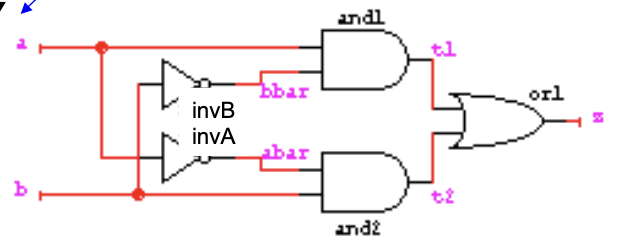
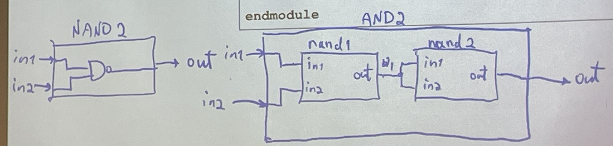

# Verilog Review for Programmers

This cheat sheet covers basic Verilog for hardware design, as presented in the notebook.

## Background & Overview
ASICs - application specific, baked in, custom designed, for single purpose, cheaper for mass production
FPGAs - Programmable chips, for multiple purposes/design/prototypes, expensive for mass production
Both works with verilog code.
### Terminology
- **Structural Description** (Netlist/Gatelevel/transistor level) - detail to gates
- **Behavioral Description** - Describe functionality without gate specification (looks like c)
- **Testing description** designed for simulation
- HDLs (Verilog, VHDL)

## Fundamentals
### comments
- single-line comments `//`
- mulit-line coments `/* ...*/`
### operators
- Unary = `a = ~b;`
- Binary =  `a = b & c;`
- Ternary `a = (b<c)? b : c;`
### Encapsulation
```verilog
module and_gate (
  input  in1, in2,
  output  out);

  <module internals>

endmodule
```
## Structural Verilog
example
```verilog
module xor_gate(
  input a, b,
  output z);

  wire abar, bbar, t1, t2;

  not invA (abar, a);
  not invB (bbar, b);
  and and1 (t1, a, bbar);
  and and2 (t2, b, abar);
  or or1 (z, t1, t2)
endmodule
```
This is:


### Functional Example
```verilog
module fulladder(
  input a, b, cin,
  output sum, court);

  assign sum = a ^ b ^ cin;
  assign cout = a & b | a & cin | b & cin;
endmodule
```
synthesis tool can turn this logic into a gate-level verilog
## Behavioral Verilog
- Uses procedural block to describe behavior without explicit binding to HW
- Procedural assignments (e.g., always) can only manipulate register variables
```verilog
module compare (
  input[1:0] A, B,
  output A_lt_B, A_gt_B, A_eq_B);
  reg A_lt_B; // Storage container
  reg A_gt_B;
  reg A_eq_B;
  always @(A or B) // detect event
  begin
    A_lt_B = 0;
    A_gt_B = 0;
    A_eq_B = 0;
    if (A == B) A_eq_B = 1;
    else if (A > B) A_gt_B = 1;
    else A
  end
endmodule
```
## Some comments on Examples
- Verilog describes a circuit as a set of modules
- Each module has input and output ports
  - Single bit
  - Multiple bit – array syntax
- Each port can take on a digital value (0, 1, X[unknown], Z[high impedance])
- May contain multiple assign statements, primitives, behavioral statements, and instantiated modules - all run concurrently
- Three main ways to specify module internals
  - Continuous assignment statements – `assign`
  - Concurrent statements – `always`
  - Submodule instantiation (hierarchy)

## Module Hierarchy
Connect modules together to form larger modules
```verilog
module NAND2 (
  input in1, in2,
  output out);
  assign out = ~(in1 & in2);
endmodule
```
```verilog
module AND2 (
  input in1, in2,
  output out);
  wire w1; // to connect the 2 NAND's
  NAND2 nand1(.in1(in1),.in2(in2),.out(w1));
  NAND2 nand2(w1,w1,out);
endmodule
```


## Data types
- Wire - Represent connections between hardware elements
```verilog
wire a; // declare a wire a
wire b,c; // declare two wires b, c
```
- Register - Represent data storage elements
  - Registers retain value until another value is placed/assigned
  - Registers are not necessarily built from edge triggered flip-flops
  - Registers do not need drivers or a clock to change value
```verilog
reg reset; // declare a variable reset that can hold its value
initial // do once at beginning of simulation
begin
  reset = 1’b1; // initialize reset to 1
  #100 reset = 1’b0; // after 100 time units reset, deassert
end
```
### Vectors
```verilog
wire a;                     // scalar net variable, default
wire [7:0] bus;             // 8-bit bus
wire [31:0] busA,busB,busC; // 3 buses of 32-bit width
reg clock;                  // scalar register, default

busA[7]   // bit # 7 of vector busA
busB[2:0] // three least significant bits
          // of busB
```
## Verilog Numbers
- Sized numbers: <size>'<base><number>
  - <size> - decimal number specifying number of bits
  - <base> - b – binary, d – decimal, o – octal, h – hex
  - <number> - consecutive digits
    - normal digits 0, 1, …, 9 (if appropriate for base)
    - hex digits a, b, c, d, e, f
    - x "unknown" digit
    - z "high-impedance" digit
- Examples
  `4’b1111` `12’h7af` `16’d255`

## Testbench Example
```verilog
module stimulus;
reg clk, reset;
wire[3:0] q;

// instantiate the design block
ripple_carry_counter r1(q, clk, reset); // inc on uptick

// control the clk signal that drives the design block
// cycle time = 10
initial
  clk = 1’b0; // set clk to 0 – this is done only once

always
  #5 clk = ~clk; // toggle clk every 5 time units

// control the reset signal that drives the signal block
// reset is asserted from 0 to 15 and from 195 to 205
initial begin
  reset = 1’b1; // reset at 0
  #15 reset = 1’b0; // release reset at 15
  #180 reset = 1’b1; // reset at 195
  #10 reset = 1’b0; // release reset at 205
  #20 $finish; // terminate the simulation
end
endmodule
```

## Example: 16-bit Adder
```verilog
module Add_rca_16 (
  output [15:0] sum,
  output c_out,
  input [15:0] a, b,
  input c_in);

  wire c_in4, c_in8, c_in12;

  Add_rca_4 M1 (sum[3:0], c_in4, a[3:0], b[3:0], c_in);
  Add_rca_4 M2 (sum[7:4], c_in8, a[7:4], b[7:4], c_in4);
  Add_rca_4 M3 (sum[11:8], c_in12, a[11:8], b[11:8], c_in8);
  Add_rca_4 M4 (sum[15:12],c_out, a[15:12], b[15:12], c_in12);
endmodule
```
```verilog
module Add_rca_4 (
  output [3:0] sum,
  output c_out,
  input [3:0] a, b,
  input c_in);

  wire c_in1, c_in2, c_in3;

  Add_full M1 (sum[0], c_in1, a[0], b[0], c_in);
  Add_full M2 (sum[1], c_in2, a[1], b[1], c_in1);
  Add_full M3 (sum[2], c_in3, a[2], b[2], c_in2);
  Add_full M4 (sum[3], c_out, a[3], b[3], c_in3); // a lot of repetition, prone to mistake
endmodule
```
```verilog
module Add_full(
  output sum, c_out,
  input a, b, c_in);
  wire w1, w2, w3;
  Add_half M1 (w1, w2, a, b);
  Add_half M2 (sum, w3, w1, c_in);
  or M3 (c_out, w2, w3);
endmodule

module Add_half(
  output sum, c_out,
  input a, b);
  xor M1 (sum, a, b);
  and M2 (c_out, a, b);
endmodule
```
### generate
Generate loop constructs allow a block of code to be
instantiated multiple times, controlled by a variable index. get rid of repetition
```verilog
module Add_rca_4 (
  output [3:0] sum,
  output c_out,
  input [3:0] a, b,
  input c_in);

  wire [4:0] c;

  genvar i; //loop index, used to evaluate, loop during elaboration

  generate
  for (i=0; i<4; i=i+1)
    begin
      Add_Full FA_1bit(sum[i], c[i+1], a[i], b[i], c[i]);
                              //c_out.             c_in
    end
  endgenerate

  assign c[0] = c_in;
  assign c_out = c[4];
endmodule
```
## other review
### conditional operators
```verilog
module noname(
  input [3:0] d0, d1,
  input s,
  output [3:0] y);

  assign y = s ? d1 : d0; // if s=1, y=d1, else y=d0
endmodule
```
### more operators
- Arithmetic: `+ - * / %`
- Comparison: `== != < <= > >=`
- Shifting: << >>
-
```verilog
module adder(
  input [31:0] a, b,
  output [31:0] y);

  assign y = a + b;
endmodule
```
### concatenation {}
```verilog
module adder(
  input [31:0] a, b,
  output [31:0] y,
  output cout);

  assign {cout,y} = a + b;
endmodule
```
###replication
{ n {pattern} } replicates a pattern n times
```verilog
module noname(
  input [15:0] a,
  output [31:0] y);
  assign y = {16{a[15]}, a[15:0]};
endmodule
```
## Assignments
- Blocking - execute in sequence
  ```verilog
  always @(posedge CLK)
    begin
      temp = B;
      B = A;
      A = temp;
    end
  ```
- Nonblocking - allow simultaneous scheduling
  ```verilog
  always @(posedge CLK)
    begin
      A <= B;
      B <= A;
    end
  ```
### Delay-Based Time Control
### Event-Based Time Control
